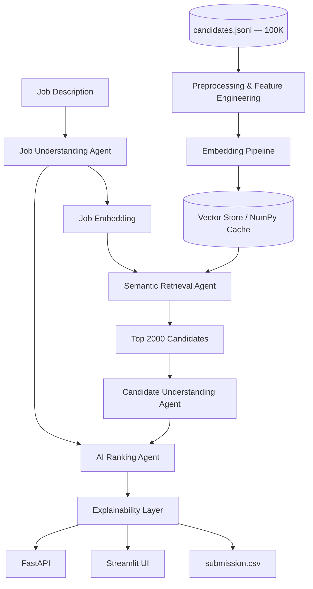

# SemFit AI — Intelligent Candidate Ranking System

[](https://internshala.com/competitions/india-runs-by-redrob-ai/)
[](https://www.python.org/)
[](LICENSE)

**Team:** SemFit AI Labs  
**Team Leader:** Modalavalasa Chaitanya  
**Challenge:** Redrob India Runs — Data & AI Track  
**Problem:** Rank 100,000 candidates by true job fit — not keyword matching

---

## Overview

SemFit AI is a production-grade **AI-powered candidate ranking system** built for the Redrob hiring challenge. It reads a full job description, understands what the role actually needs, analyzes complete candidate profiles (resume, skills, platform activity, behavioral signals), and delivers an explainable top-100 shortlist that recruiters can trust.

> *"Recruiters go through hundreds of profiles and still miss the right person — not because the talent isn't there, but because keyword filters can't see what actually matters."*

Our system ranks candidates the way a great recruiter would: through **semantic understanding**, not string matching.

---

## Key Features

| Feature | Description |
|---------|-------------|
| **Job Understanding Agent** | Extracts skills, experience, behavior, domain from JD |
| **Candidate Understanding Agent** | Builds structured profiles from resume + Redrob signals |
| **Embedding Pipeline** | Vectorizes job + candidate narratives (sentence-transformers / sklearn) |
| **Semantic Retrieval** | Top-2000 candidates via cosine similarity — **no keyword matching** |
| **AI Ranking Agent** | 100-point multi-signal scoring with honeypot detection |
| **Explainable AI** | Strengths, weaknesses, missing skills, reasoning per candidate |
| **Streamlit Dashboard** | Upload JD, run ranking, download CSV |
| **FastAPI Backend** | REST API for programmatic ranking |
| **Offline Submission** | `rank.py` runs without network (challenge compliant) |

---

## Architecture



### Agent Workflow (LangGraph)

```
understand_job → retrieve_candidates → understand_candidates → rank_candidates → finalize
```

### Scoring Formula (100 points)

| Component | Weight | Signals Used |
|-----------|--------|--------------|
| Skill Match | 30 | Required/preferred skills, proficiency, assessments, trust score |
| Project Relevance | 20 | Career descriptions, semantic similarity, title-career consistency |
| Experience Match | 20 | Years in band, relevant ML/AI titles |
| Behavioral Match | 15 | Redrob response rate, interviews, recruiter saves |
| Learning Potential | 15 | GitHub activity, profile completeness, self-learning signals |

**Trust Multiplier:** `(0.55 + 0.25×skill_trust + 0.20×title_career_consistency) × title_relevance`

This penalizes **honeypot profiles** — candidates who keyword-stuff AI skills without matching career history.

---

## Dataset

| Field | Details |
|-------|---------|
| **Size** | 100,000 candidate profiles |
| **Format** | JSONL (`candidates.jsonl`) |
| **Schema** | `candidate_id`, `profile`, `career_history`, `education`, `skills`, `redrob_signals` |
| **Honeypot pattern** | High AI skill count + non-AI title/career mismatch |

See [`docs/er_diagram.md`](docs/er_diagram.md) for full ER diagram and field mapping.

---

## Challenges We Solved

### 1. Keyword Stuffing / Honeypot Profiles
Many candidates list 8–10 AI skills while their career history describes HR, accounting, or mechanical engineering roles. We detect this via **title-career consistency scoring** and **skill trust verification** (assessments vs claimed proficiency).

### 2. Uniform Skill Distribution
Skills appear ~12,000 times each across 100K profiles — skill lists alone are unreliable. We embed **full candidate narratives** (summary + career + signals) for semantic matching.

### 3. Offline Ranking Constraint
Challenge requires `has_network_during_ranking: false`. We precompute embeddings offline and run `rank.py` with zero API calls in ~2 minutes on CPU.

### 4. Explainability Without Hallucination
Every ranking includes **evidence-backed reasoning** tied to measurable features (years, AI skill count, response rate, component scores) — not free-form LLM guesses during submission ranking.

### 5. Scale
100K profiles encoded and searched via vectorized cosine similarity on precomputed embeddings (~3GB matrix, batch retrieval).

---

## Results (Sample Run)

**Top 3 ranked candidates:**

| Rank | Candidate ID | Title | Score |
|------|-------------|-------|-------|
| 1 | CAND_0002025 | Senior AI Engineer | 72.7/100 |
| 2 | CAND_0001610 | Machine Learning Engineer | 69.2/100 |
| 3 | CAND_0078002 | Machine Learning Engineer | 67.6/100 |

**Top-100 title mix:** 70+ ML/AI roles (AI Engineer, ML Engineer, Data Scientist, NLP Engineer, etc.) vs only 1 HR Manager — honeypot filtering works.

**Runtime:** ~115 seconds ranking (after 7-min one-time embedding precompute)  
**Submission:** Validates against official `validate_submission.py` ✅

Full metrics: [`outputs/evaluation_metrics.json`](outputs/evaluation_metrics.json)

---

## Quick Start

### Prerequisites
- Python 3.11+ (recommended)
- 16 GB RAM
- `candidates.jsonl` from Redrob challenge dataset

### Windows (CMD) — Easiest

```cmd
cd ai-candidate-ranking-system
setup_env.bat
run_precompute.bat
run_rank.bat
run_streamlit.bat
```

### Manual (Mac/Linux/Windows)

```bash
git clone https://github.com/modalavalasachaitanya/semfit-ai-candidate-ranker.git
cd semfit-ai-candidate-ranker
python -m venv .venv
source .venv/bin/activate          # Windows: .venv\Scripts\activate
pip install -r requirements.txt

# Set dataset path
export CANDIDATES_PATH="/path/to/candidates.jsonl"

# One-time embedding precompute (~7 min)
python precompute_embeddings.py

# Generate submission (~2 min)
python rank.py --out outputs/submission.csv
python validate_submission.py outputs/submission.csv
```

### Streamlit Dashboard

```bash
streamlit run frontend/app.py
```

### FastAPI

```bash
uvicorn api.main:app --reload --port 8000
```

| Endpoint | Method | Description |
|----------|--------|-------------|
| `/health` | GET | Health check |
| `/dataset/stats` | GET | Dataset EDA summary |
| `/rank` | POST | Run ranking pipeline |
| `/rank/export` | POST | Rank + export CSV |

---

## Project Structure

```
semfit-ai-candidate-ranker/
├── agents/                 # Job, candidate, retrieval, ranking agents + LangGraph workflow
├── api/                    # FastAPI backend
├── core/                   # Config, schemas, data loaders
├── data/                   # Job description, schema, samples
├── docs/                   # Architecture, ER diagram, submission deck, report
├── embeddings/             # Sentence-transformer / sklearn embedding pipeline
├── evaluation/             # Ranking quality metrics
├── frontend/               # Streamlit recruiter dashboard
├── outputs/                # submission.csv, ranked_candidates.csv, reports
├── preprocessing/          # Feature engineering, honeypot detection
├── scripts/                # analyze_data.py, generate_evaluation.py
├── tests/                  # Unit tests
├── vector_store/           # ChromaDB + numpy embedding cache
├── rank.py                 # Offline submission CLI
├── precompute_embeddings.py
├── setup_env.bat           # Windows one-click setup
├── run_rank.bat
├── run_streamlit.bat
└── requirements.txt
```

---

## Submission Files

| File | Purpose |
|------|---------|
| `outputs/submission.csv` | **Hackathon ranked output** (100 rows) |
| `docs/REDDROB_SUBMISSION_DECK.md` | PDF deck content for portal upload |
| `submission_metadata.yaml` | Reproducibility metadata |

---

## Tech Stack

| Layer | Technology | Why |
|-------|-----------|-----|
| Language | Python 3.11 | Ecosystem for ML + APIs |
| Agents | LangGraph | Orchestrated multi-agent pipeline |
| LLM (optional) | Gemini 2.5 Pro | Job/candidate understanding (online mode) |
| Embeddings | sentence-transformers / sklearn | Offline semantic vectors |
| Vector DB | ChromaDB + NumPy | Fast similarity search |
| Backend | FastAPI | Production REST API |
| Frontend | Streamlit | Recruiter dashboard |
| ML | scikit-learn, numpy | Feature engineering + fallback embeddings |

---

## Team

| Name | Role |
|------|------|
| **Modalavalasa Chaitanya** | Team Leader, ML Engineer & Architect |

**Team Name:** SemFit AI Labs  
**GitHub:** [github.com/modalavalasachaitanya/semfit-ai-candidate-ranker](https://github.com/modalavalasachaitanya/semfit-ai-candidate-ranker)

---

## Documentation

- [Architecture](docs/architecture.md)
- [ER Diagram & Data Schema](docs/er_diagram.md)
- [Technical Report (PDF-ready)](docs/report.md)
- [Submission Deck (PDF-ready)](docs/REDDROB_SUBMISSION_DECK.md)
- [Troubleshooting](TROUBLESHOOTING.md)

---

## License

MIT License — Built for the Redrob India Runs Data & AI Challenge 2026.
