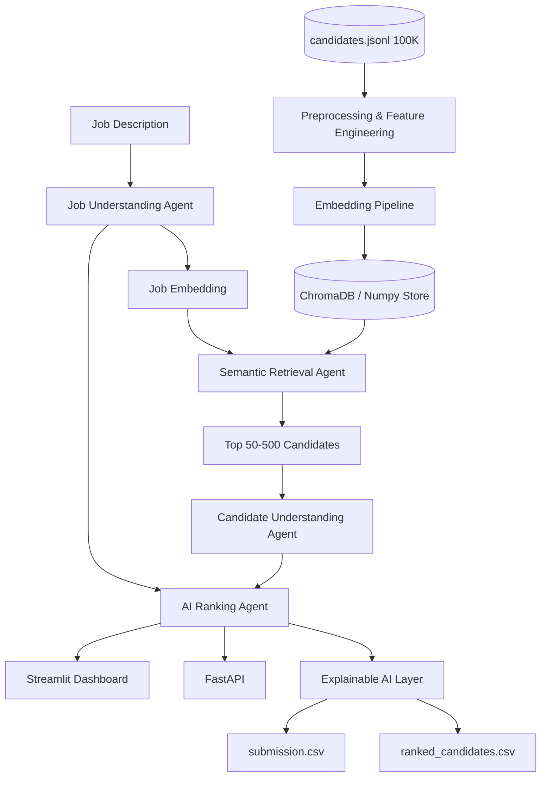

# AI Candidate Ranking System — Architecture

## System Overview

Recruiter-grade semantic ranking pipeline that evaluates **true job fit** using multi-signal understanding, vector retrieval, and explainable scoring.



## Agent Workflow (LangGraph)

| Step | Agent | Input | Output |
|------|-------|-------|--------|
| 1 | Job Understanding | Raw JD text | Structured JSON: skills, experience, behavior, domain |
| 2 | Semantic Retrieval | Job embedding + vector index | Top-K candidates by cosine similarity |
| 3 | Candidate Understanding | Raw candidate JSON | Structured profile + trust/consistency features |
| 4 | Ranking | Job profile + candidate features | 100-point score + reasoning |
| 5 | Explainability | Ranked list | Strengths, weaknesses, missing skills |

## Scoring Formula (100 points)

| Component | Weight | Signals |
|-----------|--------|---------|
| Skill Match | 30 | Required/preferred skills, proficiency, assessments, trust multiplier |
| Project Relevance | 20 | Career descriptions, semantic similarity, title-career consistency |
| Experience Match | 20 | Years in band, relevant titles |
| Behavioral Match | 15 | Redrob signals: response rate, interviews, recruiter saves |
| Learning Potential | 15 | GitHub activity, profile completeness, self-learning narrative |

**Anti-honeypot multiplier:** `0.55 + 0.25×skill_trust + 0.20×title_career_consistency`

## Technology Stack

- **Backend:** Python, FastAPI
- **Orchestration:** LangGraph
- **LLM (optional online):** Gemini 2.5 Pro / Flash
- **Embeddings (offline ranking):** sentence-transformers/all-MiniLM-L6-v2
- **Vector DB:** ChromaDB + numpy cache
- **Frontend:** Streamlit

## Offline Ranking Constraint

Hackathon submission requires `has_network_during_ranking: false`. The `rank.py` CLI uses:

1. Precomputed candidate embeddings (`precompute_embeddings.py`)
2. Rule-based job understanding (no API)
3. Vectorized cosine similarity + heuristic scoring

## Folder Structure

```
project/
├── data/                  # JD, schema, sample data
├── agents/                # LangGraph agents
├── embeddings/            # Embedding pipeline
├── vector_store/          # ChromaDB manager
├── api/                   # FastAPI service
├── frontend/              # Streamlit app
├── core/                  # Config, schemas, loaders
├── preprocessing/         # Feature engineering
├── evaluation/            # Metrics
├── outputs/               # CSV + JSON reports
├── tests/
├── docs/
├── rank.py                # Submission CLI
└── precompute_embeddings.py
```
