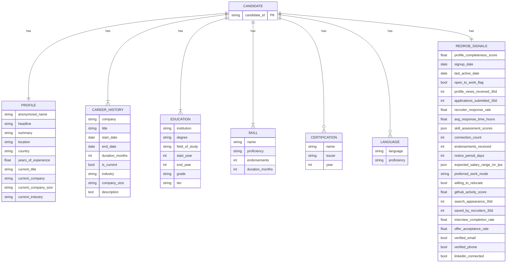
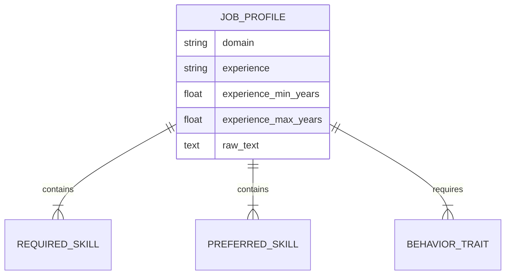
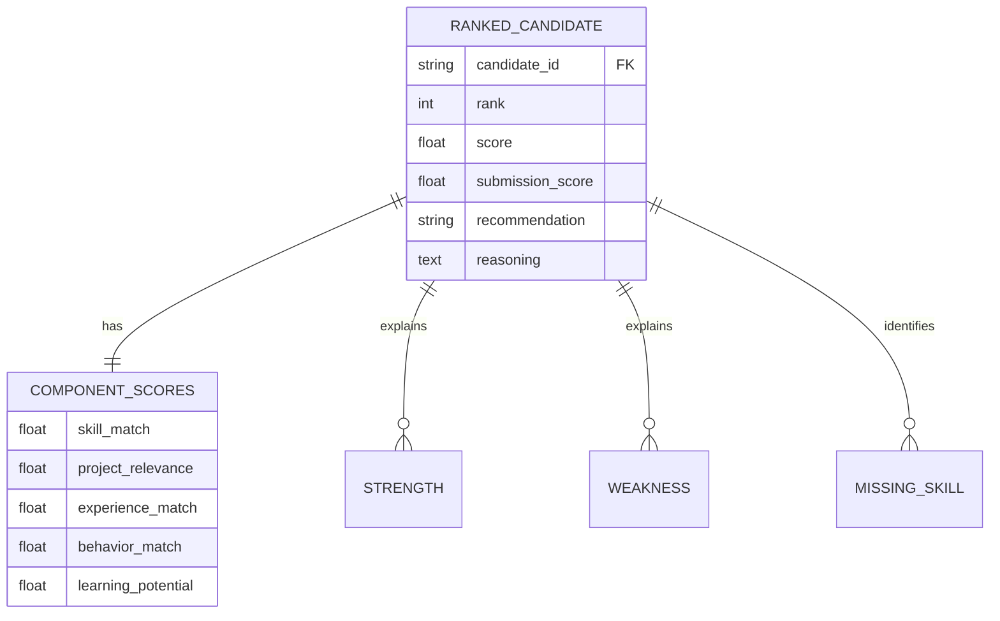

# Entity-Relationship Diagram

## Candidate Domain Model

## Job Understanding Output

## Ranking Output

## Missing Value Summary (100K corpus sample)

| Field | Missing Rate (approx.) |
|-------|------------------------|
| certifications | ~high (many empty arrays) |
| skill_assessment_scores | ~majority empty |
| github_activity_score | -1 when no GitHub |
| offer_acceptance_rate | -1 when no offer history |
| end_date (current role) | null for current jobs |

## Candidate vs Job Field Mapping

| Job Field | Candidate Sources |
|-----------|-------------------|
| Required skills | skills[], career_history.description, skill_assessment_scores |
| Experience band | profile.years_of_experience, career_history.duration_months |
| Domain | profile.current_industry, education.field_of_study |
| Behavioral traits | profile.summary, redrob_signals.* |
| Project relevance | career_history.description (semantic match) |
| Learning potential | github_activity_score, certifications, profile_completeness_score |
